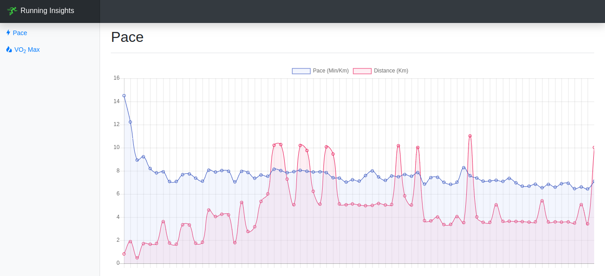
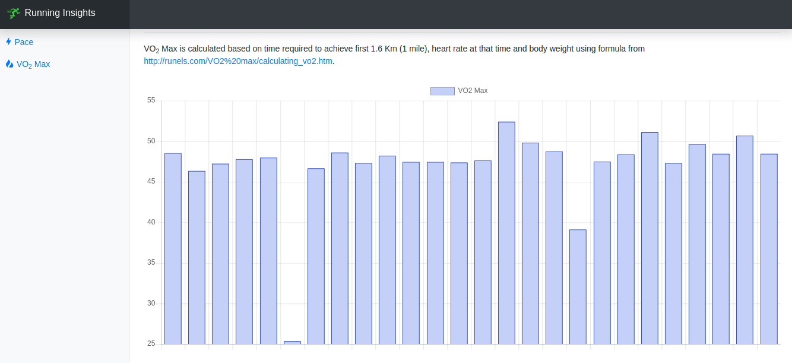

# Unofficial Endomondo Insights

Unofficial Endomondo web-based personal running insights based on awesome [endomondo-unofficial-api](https://github.com/kanekotic/endomondo-unofficial-api).

## Setup

Setup steps:

1. Clone this repo
1. Install dependencies from repo dir `npm install`

## Usage

Run commands from repo dir:

1. Download or update workouts by passing account details `npm run download -- user@gmail.com secretpassword --after 2018-01-01 --gender M --weight 83`. Check detailed options by running `npm run download -- -h`
1. Once download process finished, your workouts file will be saved under `data/`
1. Run web server `npm start`
1. Access analytics from browser at `http://localhost:3000`

> Currently you need to pass `gender` and `weight` information manually as current APIs don't retrieve them

## Disclaimer, legalese and everything else.

This is not affiliated or endorset by Endomondo, or any other party. This software available on the site is provided "as is" and any expressed or implied warranties, including, but not limited to, the implied warranties of merchantability and fitness for a particular purpose are disclaimed. In no event shall the user under the pseudonym Kanekotic, or any of their contributors be liable for any direct, indirect, incidental, special, exemplary, or consequential damages (including, but not limited to, procurement of substitute goods or services; loss of use, data, or profits; or business interruption) however caused and on any theory of liability, whether in contract, strict liability, or tort (including negligence or otherwise) arising in any way out of the use of this software, even if advised of the possibility of such damage.
